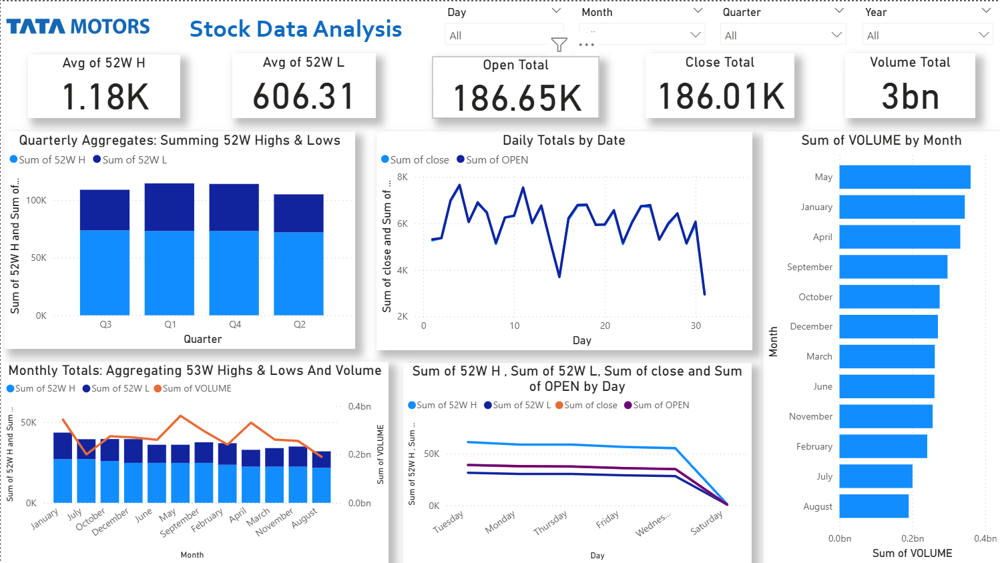

# 🚗 End-to-End Stock Performance Dashboard: Tata Motors

## Project Overview
This project involved a comprehensive, end-to-end data pipeline focused on analyzing the historical performance of **Tata Motors Stock (NSE: TATAMOTORS)**. The primary goal was to acquire, clean, and transform one year of stock data into a dynamic, interactive Power BI dashboard to track key financial metrics and visualize long-term trends.

## 🛠️ Technology Stack
* **Data Source:** NSE India (Historical TATAMOTORS data)
* **Data Preparation & Cleaning:** **MS Excel** (for initial cleaning and data structure manipulation)
* **Visualization & Modeling:** **Power BI** (for interactive dashboard design, data modeling, and visualization)

---

## Data Preparation & Engineering Highlights

The data pipeline focused on ensuring high data quality and enabling multi-dimensional analysis:

* **Data Cleaning:** Rigorously cleaned and formatted the raw data in Excel, specifically correcting data type issues (e.g., volume/trade number formats) to prevent aggregation errors in Power BI.
* **Feature Engineering:** Engineered crucial temporal features (**Day, Month, Quarter, Year**) from the Date column to allow for filtering and trend analysis across all time horizons.
* **Integrity Check:** Verified the accuracy of over 250 daily records for key price points (Open, High, Low, Close) and Volume.

---

## 📊 Key Dashboard Features and Insights

The resulting Power BI dashboard offers executive-level insights through dynamic visualization:

### Core Performance Metrics (KPI Cards)
The dashboard showcases five core financial metrics for immediate performance assessment:
* Average **52-Week High** and **52-Week Low** Prices
* Total Trading **Volume**
* Total **Closing** and **Opening** Value

### Key Visualizations
1.  **Quarterly Performance:** Stacked column chart showing the relationship between **52-Week High and Low** values segmented by **Quarter**, revealing seasonal volatility.
2.  **Volume & Price Trend:** Combination chart tracking **High, Low, and Volume** over monthly periods to identify periods of high trading activity.
3.  **Daily Movement:** Time-series line charts visualizing daily **Open and Close** price fluctuations to understand intraday stability.

### User Interactivity
* **Slicers:** Implemented four dynamic slicers (**Day, Month, Quarter, Year**) allowing users to dynamically filter all visuals for granular, time-based analysis.

---

## 📸 Dashboard Preview

